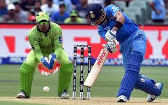

# Cricket_Score_Prediction
 
 
 
 
Predicting the future sounds like magic whether it be detecting in advance the intent of a potential customer to purchase your product or figuring out where the price of a stock is headed. If we can reliably predict the future of something, then we own a massive advantage. Machine learning has only served to amplify this magic and mystery.

**Applications**

The main objective of sports prediction is to improve team performance and enhance the chances of winning the game. The value of a win takes on different forms like trickles down to the fans filling the stadium seats, television contracts, fan store merchandise, parking, concessions, sponsorships, enrollment and retention.

**Environment and tools**
- Spyder
- Numpy
- Pandas
- HTML
- CSS
- JavaScript
- Scikit-learn

**Prerequisites :**
This post assumes familiarity with basic Machine Learning concepts Regressions like Linear Regression , Logistic Regression , SVM , Decision Tree , Randomn Forest etc.
we used ***Linear Regression*** because it works better on the dataset.
you can use any Regression Technique for your Purpose.

Front end :-knowledge of HTML CSS JS Booststrap

Backend :- Python programing and Flask.

**How to Run**
1. Clone the repository
2. open cmd prompt
3. Create a new enviornment
4. write the command --> pip install -r requirements.txt
5. Run crc.py

**Creators :**

 [Mahesh Dhoran](https://www.linkedin.com/in/maheshdhoran/)
 
 [Pratish Varma](https://www.linkedin.com/in/pratishvarma/)
